# Nodejs基础 
## 目录 2
### 第1章 介绍 3
#### 1.1 宿主环境 3
#### 1.2 安装 4
#### 1.3 环境变量 5
#### 1.4 体验Nodejs 9
### 第2章 基础 9
#### 2.1 基础语法 9
#### 2.2 ES6 10
#### 2.2.1 块级作用域 11
#### 2.2.2 let 关建字 11
#### 2.2.3 const关键字 11
#### 2.2.4 变量解构赋值 11
#### 2.2.5 字符串扩展 12
#### 2.2.6 数组扩展 12
#### 2.2.7 函数扩展 12
### 第3章 模块 12
#### 3.1 系统模块 13
#### 3.2 文件模块 13
#### 3.2.1 第三方模块 13
#### 3.2.2 用户模块 15
 

 
# 第1章介绍
Node.js是一个基于Chrome V8引擎的JavaScript运行环境，其使用了一个事件驱动、非阻塞式 I/O的模型，使其轻量又高效。
## 1.1 宿主环境
以网景的Netscape Navigator内置的JavaScript 1.1为蓝本，由ECMA-262定义的 ECMAScript 是一种脚本语言标准，它对该脚本语言的语法、类型、语句、操作符等做出明确规定。
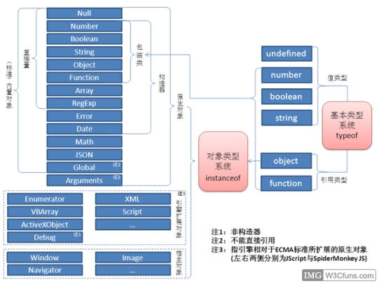
 
Javascript是由ECMAScript、DOM、BOM三部分组成，浏览器实现了ECMAScript标准，使其能够运行于浏览器，我们称浏览器为ECMAScript的宿主环境。
除了可以运行于浏览器环境外，ECMAScript还可以运行于Adobe  Flash环境中（称为Action Script），这时Adobe Flash也是ECMAScript的宿主环境。
我们即将学习的Nodejs就是另一种可以运行ECMAScript的宿主环境。
## 1.2 安装
Nodejs是开源、跨平台（即可以运行在不同的操作系统上）的。
Windows平台，Nodejs就是一个以.msi结尾的软件，由于Windows操作系统分成32位和64位，所以在Nodejs在Windows上也分为32位和64位两个版本。
Linux平台，根据其发行版不同，其安装方式也不同，但都可以使用源码编译安装。
Mac平台，Nodejs是一个.pkg结尾的包，双击根据引导即可完成安装。
不论何种平台，检测Nodejs是否安装都可以通过命令 node -v，这个命令是执行结果会返回当前Nodejs的版本，以Windows平台为例，如下图：

 
## 1.3 环境变量
执行命令node -v时，其实是运行了一个名叫node.exe的可执行程序，操作系统自动查找并调用node.exe这个可执行程序，同样的我们也可以使用命令来执行其它可执行程序，以FeiQ.exe为例，如下图所示：

 
其实并不是在任意位置都可以执行feiq命令(windows平台不区分大小写)，如下图所示：
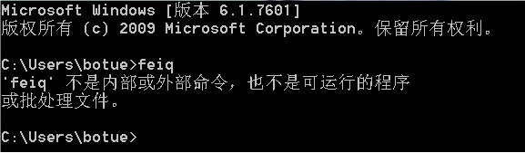
必须输入FeiQ.exe的绝对路径或将目录调整到FeiQ.exe所在目录才能被执行，
如下图所示：
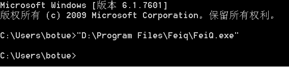
但是在执行node命令时却不需要，出现这种差别的原因在于环境变量。
环境变量是在操作系统中一个具有特定名字的对象，它包含了一个或者多个应用程序所将使用到的信息。
当在命令行窗口输入某个命令要求系统运行一个程序而没有告诉它程序所在的完整路径时，操作系统会优先当前目录下面查找此程序，找到则执行，找不到会到环境变量path中去找。
一般情况下安装Nodejs时，会自动设置path环境变量，所以安装完成立即执行node -v就能被执行，但是也有各别情况环境变量不能自动被添加，这时就需要手动添加。
步骤1
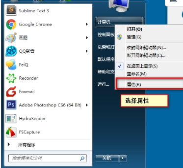
步骤2
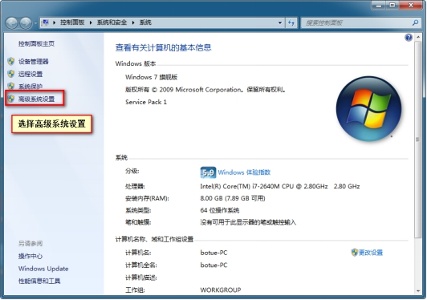
 
步骤3
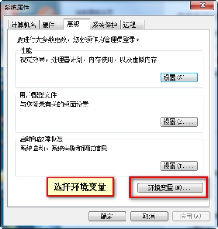
 
步骤4
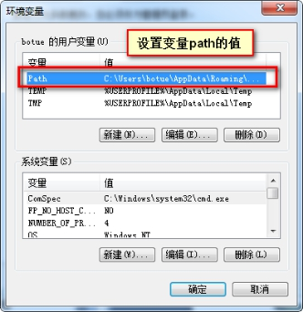
 
步骤5

 
## 1.4 体验Nodejs
宿主环境不同依据ECMAScript标准实现的脚本的执行方式也不同，例如Javascript必须通过script标签引入，然后在浏览器环境才能被执行，Nodejs则是需要通过命令行工具以命令的形式执行。
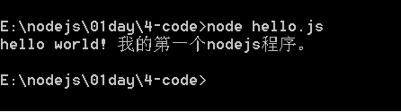
# 第2章基础
## 2.1 基础语法
Nodejs是ECMAScript的宿主环境，与浏览器中的Javascript一奶同胞，所以其基础语法是一致的，都遵循ECMAScript 的标准规范。
实践中不同的宿主环境又会在ECMAScript的基础上进行扩展，例如浏览器的javascript就扩展了window、location、navigator等对象，在Nodejs中则没有这些对象。
Nodejs也进行了扩展，主要体现在全局变量和全局方法两方面，如下：
1. require 用来加载并执行其它脚本文件
2. module用来导出脚本文件的属性或方法，详见模块章节
3. exports 用来导出脚本文件的属性或方法，详见模块章节
4. __dirname 用来获取当前文件目录
5. __filename 用来获取当前文件的绝对路径
6. global 全局对象，类似于浏览器中的window。
    *  setTimeout/clearTimeout
    * setInterval/clearInterval
    * console,proces
## 2.2 ES6
Javascript在设计之初只是用来做简单的数据较验，后来发展到可以做一些网页的动态效果用来增强用户体验，再后来ECMA组织负责组织制订javascript规范的制订，将其称为ECMAScript，伴随着互联网的迅速发展，对ECMAScript提出了更高的要求，为了适应开发的需要，ECMA组织也在不断的修改完善ECMAScript的标准（如ECMAScript6简称ES6）。
然而新的标准所定义的规范在浏览器中的javascript中并不能得到很好的应用，原因在于浏览器种类较多，开发者并不能约束用户必须使用何种浏览器，导致浏览器高低版本共存是常态，为了考虑兼容，开发者不得不放弃使用一些高级特性。
Nodejs则不会出现上述情况，Nodejs由统一的团队组织维护，通过版本升级方式可以及时跟进ECMAScript的标准，而且多数情况Nodejs是运行于服务端的，开发者可以决定使用Nodejs的版本，很多高级特性可以在Nodejs中得到很好的运用。
### 2.2.1 块级作用域
任何一对花括号（｛｝）中的语句集都属于一个块，在块中声明的变量在代码块外都是不可访问的，称之为块级作用域，ES5以前没有块级作用域
### 2.2.2 let 关建字
let用于声明变量（类似于var），其声明的变量只在当前代码块内有效，实际上是创建了块级作用域
### 2.2.3 const关键字
const 用于声明常量，常量于变量不同，变量声明后其值可以任意更改，而常量一旦赋值就不允许被更改,
所谓的变量,就是指一旦定义并初始化值后不可再修改
### 2.2.4 变量解构赋值
定义:按照某种模式，从数组和对象中提取值，对变量进行赋值这被称为解构。
* 数组解构赋值.
    * var [a, b, c] = [1, 2, 3]
    * 1)var [a, b, c, d] = [1, 2, 3]//d为undefined
    * 2)var [a, b, c] = [1, 2, 3, 4]//忽略多余的值
    * 3)var [a, b, ...c] = [1, 2, 3, 4]//c的值为[3, 4]
* 对象解构赋值
    * 先查找同名属性然后在赋值,不受顺序限制
var{arg1: name, arg2: age} = {arg1: "itcast", arg2: 19}
简写:var {name, age} = {name: "itcast", age: 19}
    * 嵌套
var {name: name, son: {sonname(:sonname)}} = {name: "shunzhi", 	
son: {sonnane: "康熙"}}
var {name, son: {sonname}} = {name: "shunzhi", 	son: {sonnane: 
"康熙"}}
    * 解析不成功为undefined
var{name, age, sex} = {name: "张三", age: 19}//sex位undefined
    * 默认值
var{name, age, sex="男"} = {name: "顺治", age:120}
    * 一般简写成:
var{name, age, sex, score} = {name:"小明",age: 18, score 99}
以上介绍了解构赋值的语法规则，可以在现实开发中带来很大的便利，提升开发效率.
* 函数赋值
function fn([a,b]){

console.log( a + b );
}
var arr = [10, 20]
fn(arr);
交换两个变量:
[a,b] = [b, a]
* 接受函数返回值

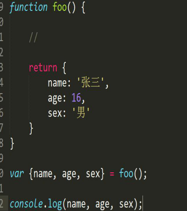
* 提取JSON对象值

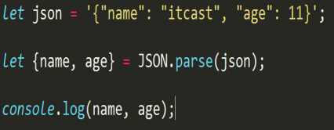
### 2.2.5 字符串扩展
* 对象方法，新增一些用于处理字符串的便捷方法 string-extends-1.js
1. includes检测字符串中是否包含某一特定字符
let str = "my name is itcast"
console.log(str.includes("a"))//检测是否存在a字符-->true
2. startWidth检测字符串是否已某一字符开头
let info = "我是一个兵";
console.log(info.startsWidth("我")); //是否是以"我"开头-->true
3. endWidth检测字符串是否已某一字符结尾
4. repeat重复某一字符
console.log("s".repeat(6))-->ssssss
* 模板字符串，可以使用反引号（`）定义字符串，见示例代码 14 string-extends-2.js
1. 使用``定义字符串
let html = `

`
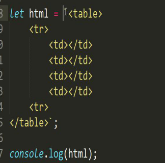
2. 运算
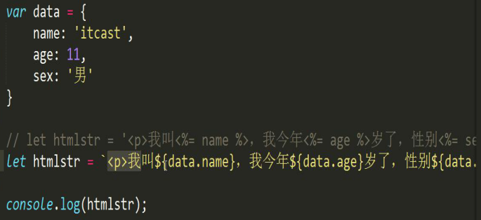
3. 调用函数

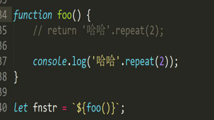
### 2.2.6 数组扩展
* Array.from()将一个伪数组转换成数组
function foo(){
consoloe.log(Array.from(arguments));
}
foo(1, 2, 3);
* 可转换拥有length属性的对象
let str = "hellow world"
console.log( Array.from(str));
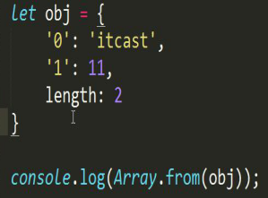
* Array.of()定义一个数组的
let arr = new Array(1, 2, 3);
let arr = new Array( 3 );//length = 3;
使用of()方法定义数组
let arr = Array.of(3);
consoloe.log(arr)//[3]
* find()从数组中知道某个单元
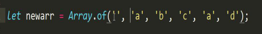

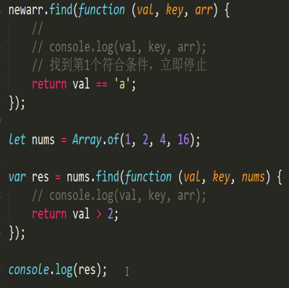

* findIndex()从数组中找到某个单元的索引
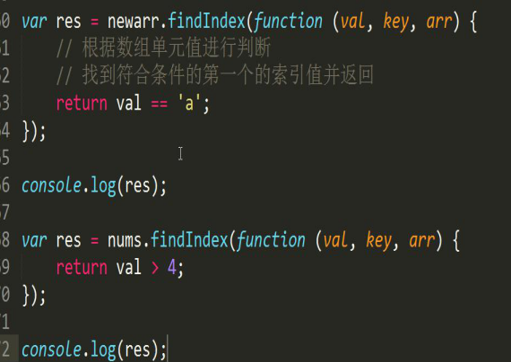

### 2.2.7 函数扩展
* 默认参数，允话为函数指定默认参数
在定义函数的时候,可以为参数设置默认值格式arg = val,当在调用函数的时候可以不传实参
function fn(a = 10){
consoloe.log( a )
}
fn();
* reset参数，用于获取多余的参数，将多余的参数装到一个数组中 function-extends-2.js
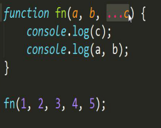
* 扩展运算符，它好比 rest 参数的逆运算，将一个数组转为用逗号分隔的参数序列 
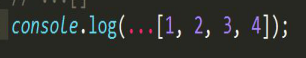

* 箭头函数，使用“箭头”(=>) 定义函数
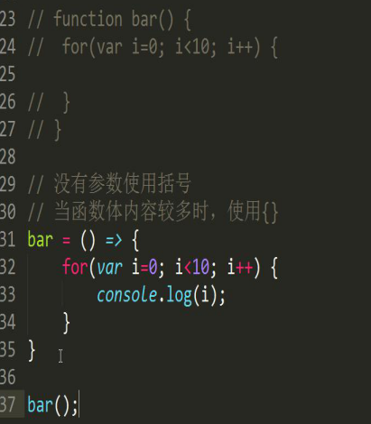

## 第3章模块
Nodejs在ECMAScript的基础上扩展并封装了许多高级特性，如文件访问、网络访问等，使得Nodejs成为一个很好的Web开发平台。
基于Nodejs这个平台将Web开发常用的一些功能进行封装，称为模块。
### 3.1 系统模块
在安装Nodejs时一些模块自动被安装，这些模块大多由Nodejs官方维护，称这类模块为系统（核心）模块，如fs、path、os、http等。
模块被加载后才能使用，Nodejs提供了全局的函数require加载模块。
1. os模块 获取当前操作系统信息，见代码示例 20 os.js
使用os系统模块可以获得当前操作系统的信息,内存,cpu...
使用require加载模块
var os = require("os");
模块是被封装的若干逻辑,通过向外提供方法来工作
os是一个对象,此对象有若干方法 
2. fs模块 文件读写操作
const fs = require( "fs" );
    *  创建一个文件夹
fs.mkdir('./fs',function(err){
//当创建失败时,err就是错误信息成功是err为null
});//第一个参数文件名名称
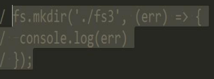
    * 删除一个文件夹
fs.rmdir('./fs3',(err)=>{
consoloe.log(err);
});
    * 创建一个文件,第一个参数文件名称,第二个参数文件内容,第三个参数回调
函数
fswriteFile('./fs/demo.txt','哈哈哈',,(err)=>{
console.log(err)
});
    * 读取一个文件,第一个参数文件路径,第二个参数编码格式
fs.readFile('./fs.hello.txt', 'utf8', (err,res)=>{
//在node.js中回调函数中的错误信息err永远都是第一个参数
console.log(err);
console.log(res);
})
    * 文件读写
fs.writeFile('./fs/demo.txt', '一些内容', (err)=>{
console.log(err);
});
fs.open('./demo.txt/', 'a', (err,fd(文件信息))=>{
//第一个参数文件路径;第二个参数打开模式:读r,写w,追加a;第三个参数	
回调函数;
//以读模式打开使用fs.write写入
fs.write(fd,'另一些内容', (err)=>{
console.log(err);
})
});
3. path模块 路径处理
    * 引入系统模块 : const pash = require( 'path' )
    * 获取所在路径: path.dirname()
    * 获取文件名:path.basename()
    * 获取后扩展名: path.extname()
* 解析路径: path.parse()
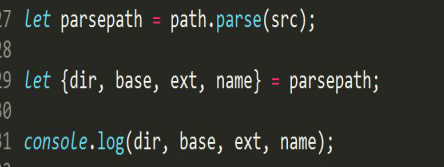
* 路径组合: path.join()
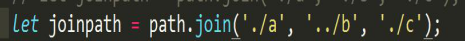

### 3.2 文件模块
除了系统模块外，还有以文件形式存在的模块，这些模块由一些组织或个人根据不同的业务需求开发。
文件模块就是以js结尾的文件或者以json结尾的文件
注：模块也被称为包。
#### 3.2.1 用户模块
1. Nodejs中文件模块分两种
* 一种是.js结尾，

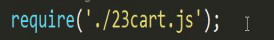
* 一种是以.json结尾，

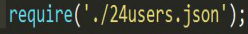
2. 使用require加载模块路径
* 相对路径，如 ./ 或 ../
* 绝对路径，如 E:\nodejs\02day\4-code\23cart 或 / (类unix系统)
* 直接写模块名会被当成系统模块或加载node_modules目录的模块
3. exports和module.exports暴露模块接口
export:  将数据公开出去
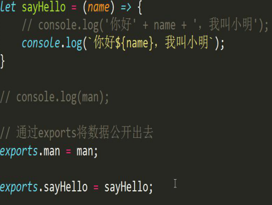
module.exports:将数据公开出去,标准的公开数据的方法,所以任何情况下调都可以使用由于module.exports相对较长,所以使用exports作为module.exports 的别名.也就是说exports =module.exports
当所要公开的数据是一个对象时不能使用exports,因为exports会被重新赋值,会与module.exports断开联系,这是只能用module.exports
4. 多文件模块（也叫包）指某一个功能模块的集合，通常由多个文件构成，统一到某一目录集中管理，并且使用package.json记录包的相关信息，例如模块名称、版本号、作者等，其中有一属性main,较为关键,此属性的含义是值当其他模块引入当前包的时候的默认引入的文件,可使用npm init根据提示创建。

#### 3.2.2 第三方模块 (nodemon)
到目前为止，第三方模块数量已经相当庞大，为了能够更好的管理这些模块，Nodejs官方提供了一个工具（npm）专门用于管理这些第三方模块。
npm (Node Package Manager) 这个工具随Nodejs一起被安装，可以使用 npm -v 检测是否安装，如下图
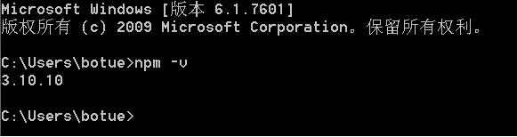
 
使用npm可以安装、卸载、发布模块。
1. 安装
* 本地安装，安将到当前目录下node_modules中
npm install 模块名称
* 全局安装，安装到默认c盘
npm install 模块名称 -g
2. 卸载
* 本地卸载
npm uninstall 模块名称
* 全局卸载
npm uninstall 模块名称 -g
3. 发布模块
* 注册用户，注册npm账号
* 编写模块
新建helloitcast.js，编写简单逻辑。
* 发布模块
在模块目录执行 npm login，根据提示输入用户名、密码、邮箱进行登录，然后执行npm publish完成发布。
# 第2章http服务
使用Nodejs系统模块http可以创建并启动http服务器。
## 2.1 搭建服务器
1. 引入http模块

 
2. 创建http服务实现
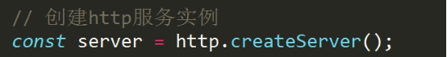
 
3. 监听端口
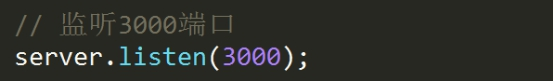
 
4. 监听http请求

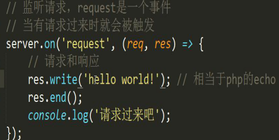
 
request事件当在 请求过来的时候就会被触发
第一个参数表示请求,第二个参数表示相应
5、浏览器访问 http://localhost:3000
## 2.2 处理响应
通过res对象处理响应，如状态码，响应头，响应主体等。

 
## 2.3 处理请求
使用req对象处理请求，如请求方式、请求头、查询参数、请求主体等。
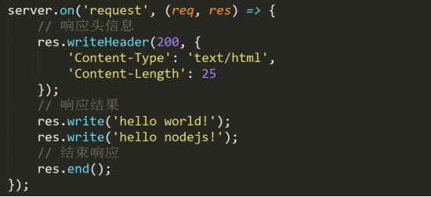
 
get 查询参数，查询字符串做为地址的一部分，需要使用url系统模块解析得到。
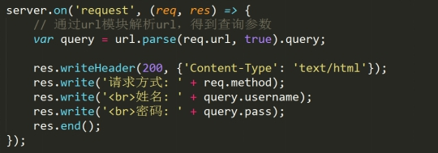
 
post参数做为请求主体传递
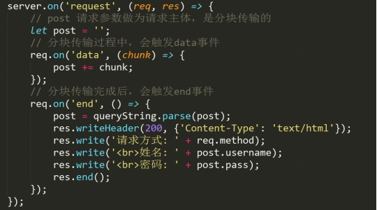
 
data是一个事件